# VPC Access Broker: Policy-Gated Automation 🛡️

**Track:** Enterprise Agents

## 🚨 The Problem

In enterprise cloud environments, developers need to connect services (e.g., "Allow GKE checkout-service to reach Cloud SQL billing-db"). However, they rarely understand the complexities of VPC firewall rules, tags, or ports.

They file Jira tickets, creating a massive bottleneck for Network Security Engineers who must manually validate every request against governance policy before applying changes. This slows down velocity and invites human error.

## 💡 The Solution

The **VPC Access Broker** is a multi-agent system that democratizes network access while enforcing strict security governance.

It allows developers to request connectivity in plain English. The system acts as a smart filter:

1.  **Auto-Approval:** Low-risk requests (e.g., internal app-to-db) are validated and applied instantly.
2.  **Conditional Guardrail:** High-risk requests (e.g., public ingress, admin ports) trigger a **Long-Running Operation (LRO)**. The agent PAUSES execution and demands human approval from a Security Engineer before resuming.

## 🏗️ Architecture

The system utilizes the **Google Agent Development Kit (ADK)** and a multi-agent architecture to separate concerns:

### 1. `VPCAccessBrokerAgent` (The Orchestrator) 🤖

- **Role:** The interface for the user.
- **Responsibility:** Translates the user's plain English request into structured parameters and coordinates the workflow between the specialist agents.

### 2. `PolicyAgent` (The Guardrail) 🛡️

- **Role:** The compliance officer.
- **Tool:** `check_policy_and_gate`
- **Logic:** Checks the request against a `review_list.json`.
- **LRO Pattern:** Implements a **Conditional Pause**.
  - If the request is safe -> Returns `approved`.
  - If the request is high-risk -> Raises an `adk_request_confirmation` event, PAUSING the entire system until a human approves.

### 3. `FirewallAgent` (The Actuator) 🔥

- **Role:** The infrastructure automation.
- **Tool:** `apply_firewall_rule`
- **Logic:** Executes the actual `gcloud` commands (simulated for this demo) to apply the rule. This agent is _never_ called unless the `PolicyAgent` has returned an `approved` status.

## 🔄 Workflow Diagram

```mermaid
graph TD
    User[Developer] --> Broker[VPCAccessBroker]
    Broker --> Policy[PolicyAgent]
    Policy -- Low Risk --> Approved[Auto-Approved]
    Policy -- High Risk --> Pause[⏸️ PAUSE: Human Review]
    Pause --> Human[Security Engineer]
    Human -- Approve --> Resume[▶️ RESUME]
    Resume --> Approved
    Approved --> Firewall[FirewallAgent]
    Firewall --> Result[Rule Applied]
    Result --> Broker
    Broker --> User
```

