# VPC Access Broker: Policy-Gated Automation 🛡️

**Track:** Enterprise Agents

## 🚨 The Problem
In enterprise cloud environments, developers need to connect services (e.g., "Allow GKE checkout-service to reach Cloud SQL billing-db"). However, they rarely understand the complexities of VPC firewall rules, tags, or ports.

They file Jira tickets, creating a massive bottleneck for Network Security Engineers who must manually validate every request against governance policy before applying changes. This slows down velocity and invites human error.

## 💡 The Solution
The **VPC Access Broker** is a multi-agent system that democratizes network access while enforcing strict security governance.

It allows developers to request connectivity in plain English. The system acts as a smart filter:
1.  **Translation:** Automatically maps friendly names (e.g., "checkout-service") to technical network tags (e.g., "app:checkout").
2.  **Auto-Approval:** Low-risk requests are validated and applied instantly.
3.  **Conditional Guardrail:** High-risk requests (e.g., public ingress, admin ports) trigger a **Long-Running Operation (LRO)**. The agent PAUSES execution and demands human approval from a Security Engineer before resuming.

## 🏗️ Architecture

The system utilizes the **Google Agent Development Kit (ADK)** and a multi-agent architecture to separate concerns:

### 1. `VPCAccessBrokerAgent` (The Orchestrator) 🤖
* **Role:** The interface for the user.
* **Responsibility:** Manages the "Chain of Thought" workflow: Lookup -> Validate -> Execute.

### 2. `GcpQueryAgent` (The Eyes) 👁️
* **Role:** The infrastructure map.
* **Tool:** `lookup_resource_tag`
* **Logic:** Resolves vague human terms ("public internet") into concrete infrastructure tags ("app:public-ingress") using a simulated CMDB.

### 3. `PolicyAgent` (The Guardrail) 🛡️
* **Role:** The compliance officer.
* **Tool:** `check_policy_and_gate`
* **Logic:** Checks the request against a `review_list.json`.
* **LRO Pattern:** Implements a **Conditional Pause**.
    * If the request is safe -> Returns `approved`.
    * If the request is high-risk -> Raises an `adk_request_confirmation` event, PAUSING the entire system until a human approves.

### 4. `FirewallAgent` (The Actuator) 🔥
* **Role:** The infrastructure automation.
* **Tool:** `apply_firewall_rule`
* **Logic:** Executes the actual `gcloud` commands (simulated for this demo) to apply the rule. This agent is *never* called unless the `PolicyAgent` has returned an `approved` status.
### 5. Observability 🔍
The system uses the **`LoggingPlugin`** to provide detailed visibility into the agent's decision-making process.
* **Role:** Automatically logs every tool call, argument, and return value.
* **Benefit:** Allows developers to trace exactly *why* an agent made a decision without cluttering the code with print statements.

## 🔄 Workflow Diagram

```mermaid
graph TD
    User[User] -->|1. Request| Broker[VPCAccessBroker]
    Broker -->|2. Resolve Tags| Query[GcpQueryAgent]
    Query -->|Return Tags| Broker
    Broker -->|3. Validate| Policy[PolicyAgent]
    
    Policy -- Low Risk --> Approved[Auto-Approved]
    
    Policy -- High Risk --> Pause[⏸️ PAUSE: Human Review]
    Pause --> Human[Security Engineer]
    Human -- Approve --> Resume[▶️ RESUME]
    Resume --> Approved
    
    Approved --> Broker
    Broker -->|4. Execute| Firewall[FirewallAgent]
    Firewall -->|Success| Broker
    Broker -->|5. Report| User
```



## Detailed Workflows & Logic

For a deep dive into the sequence diagrams, policy logic, and a line-by-line code explanation, please see the **[Technical Walkthrough](TECHNICAL_WALKTHROUGH.md)**.


## Getting Started

Follow these steps to set up and run the agent on your local machine.

### 1. Prerequisites
- **Python 3.10** or higher.
- **uv**: A fast Python package manager.
  ```bash
  curl -LsSf https://astral.sh/uv/install.sh | sh
  ```

### 2. Installation
Clone the repository and navigate to the project directory:
```bash
git clone https://github.com/your-repo/vpc-access-broker.git
cd vpc-access-broker
```

### 3. Configuration
You need a Google Cloud API Key to access the Gemini models. We use the **`python-dotenv`** library to manage this configuration securely.

> [!IMPORTANT]
> **Why use `.env`?**
> Storing API keys directly in your code is dangerous because they can be accidentally committed to GitHub.
> A `.env` file keeps your secrets local and safe. It is listed in `.gitignore` so it will never be shared publicly.
>
> The `python-dotenv` library automatically loads these variables from the `.env` file into `os.environ` when the application starts, making them accessible to your code without hardcoding.

1.  **Get an API Key**: Visit [Google AI Studio](https://aistudio.google.com/) and create a new API key.
2.  **Set up the Environment**:
    Create a `.env` file in the root of the project:
    ```bash
    touch .env
    ```
    Open `.env` and add your key:
    ```bash
    GOOGLE_API_KEY=AIzaSy...YourKeyHere
    ```

### 4. Usage

#### Step 1: Initialize the Environment
Run the following command to create the virtual environment (`.venv`) and install dependencies:
```bash
uv sync
```

#### Step 2: Configure your IDE
To ensure your code editor (like VS Code) understands the imports and uses the correct Python version:
1.  Open your IDE settings to "Select Interpreter".
2.  Select the Python executable inside the `.venv` folder created in the previous step (e.g., `./.venv/bin/python`).

#### Step 3: Run the Agent
Activate the virtual environment and run the script:

```bash
source .venv/bin/activate
python run.py
```

*Note: If you are on Windows, use `.venv\Scripts\activate` instead.*

### 5. Expected Output
The script (`run.py`) runs two automated tests. You will see detailed logs from the `LoggingPlugin` showing the agent's thought process.

1.  **Happy Path**:
    ```text
    🎬  DEMO SCENARIO: HAPPY PATH (Internal Service Connection)
    
    👤 USER: 'I need to connect my checkout-service...'
    
    INFO:google.adk.plugins.logging_plugin: [Agent: VPCAccessBrokerAgent] Calling Tool: lookup_resource_tag with args: {'friendly_name': 'checkout-service'}
    INFO:google.adk.plugins.logging_plugin: [Agent: VPCAccessBrokerAgent] Tool Output: app:checkout
    ...
    🤖 VPCAccessBroker > Success: Firewall rule applied...
    ```

2.  **High-Risk Path**:
    ```text
    🎬  DEMO SCENARIO: HIGH-RISK PATH (Public Ingress)
    ...
    ⏸️  SYSTEM ALERT: High Risk Operation Detected via Policy Agent
       Locking Workflow. Reason: Public to DB is forbidden.
    
    👮 SECURITY ENGINEER: Reviewing request...
       Action: APPROVED [✔]
    
    ▶️  RESUMING WORKFLOW...
    ...
    🤖 VPCAccessBroker > Rule applied.
    ```
