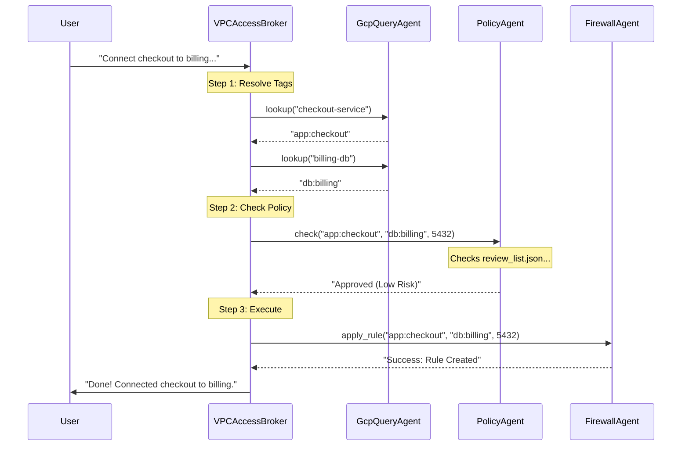
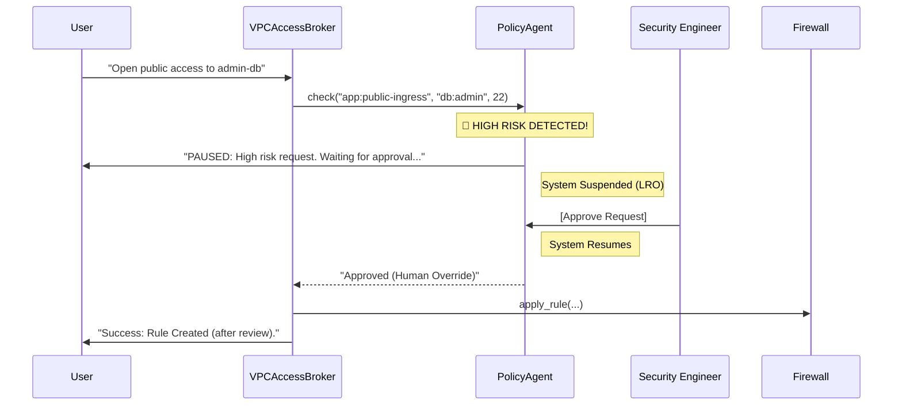

# VPC Access Broker: Technical Walkthrough 🔧

This document provides a deep dive into the inner workings of the VPC Access Broker, including detailed workflows, policy logic, and a line-by-line code explanation.

## Detailed Workflows

### Scenario A: The "Happy Path" (Auto-Approval)
*User Request: "Connect checkout-service to billing-db on port 5432"*



### Scenario B: High-Risk Request (Human Review)
*User Request: "Open port 22 from public-internet to admin-db"*



## Policy Logic (`review_list.json`)

The policy engine uses a simple JSON list to define rules. It supports wildcards (`*`).

```json
[
  {
    "from": "app:public-ingress", 
    "to": "db:*", 
    "reason": "Public to DB is forbidden." 
  }
]
```

- **Logic**: If a request matches a rule in this list, it is flagged as **High Risk**.
- **Default**: If no rule matches, it is considered **Low Risk** (Allowlist approach can also be implemented).

## Code Explanation for Beginners: `agent.py` & `run.py`

This document explains the code in `agent.py` line-by-line, assuming no prior Python knowledge. Think of this file as the "brain" of our robot.

### 1. Imports (Lines 1-7)
```python
import json
import logging
from google.adk.agents import LlmAgent
...
```
**Analogy**: This is like packing a backpack before a trip.
- We are "importing" tools we need from other places.
- `json`: A tool to read data files.
- `logging`: A tool to write into a diary (log) so we know what happened.
- `LlmAgent`: The "brain" template provided by Google to build our AI agents.

### 2. Setup (Lines 9-14)
```python
logging.basicConfig(level=logging.INFO)
POLICY_FILE = "review_list.json"
REGISTRY_FILE = "service_registry.json"
```
**Analogy**: Setting the ground rules.
- We tell the diary (`logging`) to write down important events (`INFO`).
- We define the names of our two reference books:
    - `POLICY_FILE`: The rulebook (what is allowed?).
    - `REGISTRY_FILE`: The phonebook (who is who?).

### 3. The "Eyes" - GcpQueryAgent (Lines 16-46)
This section defines the first robot, whose only job is to look things up.

#### The Tool Function (`lookup_resource_tag`)
```python
def lookup_resource_tag(friendly_name: str) -> str:
    # ... opens the registry file ...
    # ... looks for the name ...
    # ... returns the tag ...
```
**Analogy**: This is a specific skill we teach the robot.
- **Input**: A human name like "checkout-service".
- **Action**: It opens the "phonebook" (`service_registry.json`), looks for the name, and finds the technical ID ("tag").
- **Output**: The technical ID, e.g., `app:checkout`.

#### The Agent Definition (`gcp_query_agent`)
```python
gcp_query_agent = LlmAgent(
    model=Gemini(model="gemini-2.5-flash"),
    name="GcpQueryAgent",
    instruction="You are the Cloud Infrastructure Map...",
    tools=[lookup_resource_tag]
)
```
**Analogy**: Hiring the employee.
- **Model**: We give it a brain (`gemini-2.5-flash`).
- **Instruction**: We give it a job description ("You are the map...").
- **Tools**: We give it the tool we just built (`lookup_resource_tag`).

### 4. The "Guardrail" - PolicyAgent (Lines 47-97)
This is the security guard. It checks if the request is safe.

#### The Tool Function (`check_policy_and_gate`)
```python
def check_policy_and_gate(...):
    # ... checks the rulebook ...
    if match_reason:
        # HIGH RISK!
        tool_context.request_confirmation(...) # <--- PAUSE BUTTON
        return {"status": "pending_review"}
    else:
        # LOW RISK
        return {"status": "approved"}
```
**Analogy**: The security checkpoint.
- It takes the source, destination, and port.
- It reads the `review_list.json`.
- **Crucial Part**: If it finds a dangerous rule, it hits the **Pause Button** (`request_confirmation`). The whole program stops and waits for a human to say "Yes".

### 5. The "Actuator" - FirewallAgent (Lines 98-115)
This is the worker who actually flips the switches.

#### The Tool Function (`apply_firewall_rule`)
```python
def apply_firewall_rule(...):
    logging.info("APPLYING RULE...")
    return "SUCCESS..."
```
**Analogy**: The mechanic.
- It simply prints "APPLYING RULE". In a real scenario, this would run a command to change the cloud settings.

### 6. The "Boss" - VPCAccessBrokerAgent (Lines 117-151)
This is the manager who coordinates everyone.

```python
vpc_broker_agent = LlmAgent(
    ...
    instruction="""
    ...
    STEP 1: Call GcpQueryAgent to get tags.
    STEP 2: Call PolicyAgent to check safety.
    STEP 3: IF approved, Call FirewallAgent.
    ...
    """,
    tools=[
        AgentTool(gcp_query_agent),
        AgentTool(policy_agent), 
        AgentTool(firewall_agent)
    ]
)
```
**Analogy**: The Project Manager.
- It doesn't have the `lookup` or `apply` tools itself.
- Instead, its tools are **the other agents** (`AgentTool(...)`).
- Its "Instruction" is the workflow procedure: "First ask the Eyes, then ask the Guard, then tell the Worker."

### 7. The App (Lines 153-158)
```python
vpc_broker_app = App(
    name="vpc_broker_app",
    root_agent=vpc_broker_agent,
    ...
)
```
**Analogy**: Opening the office.
- We wrap the "Boss" agent into an "App" so we can run it.

### 8. The Delays (run.py)
You might notice the code waits for 10 or 30 seconds sometimes.

```python
async def rate_limited_run(...):
    ...
    print("   [Rate Limiter] Waiting 10s...")
    await asyncio.sleep(10)
```

**Analogy**: The Traffic Light.
- **Why?** We are using a free version of the "Brain" (Gemini API).
- **The Limit**: It only allows a few questions per minute.
- **The Solution**: If we ask too fast, it will crash. So, we force the program to "stop at a red light" for 10 seconds after every step. This ensures we never drive too fast and get a ticket (error).
